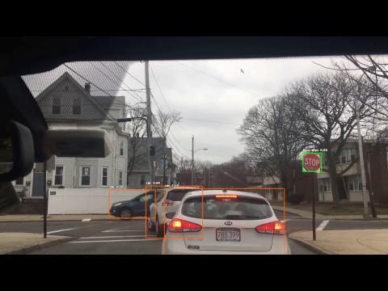
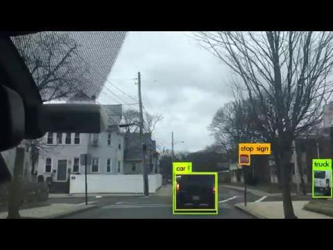
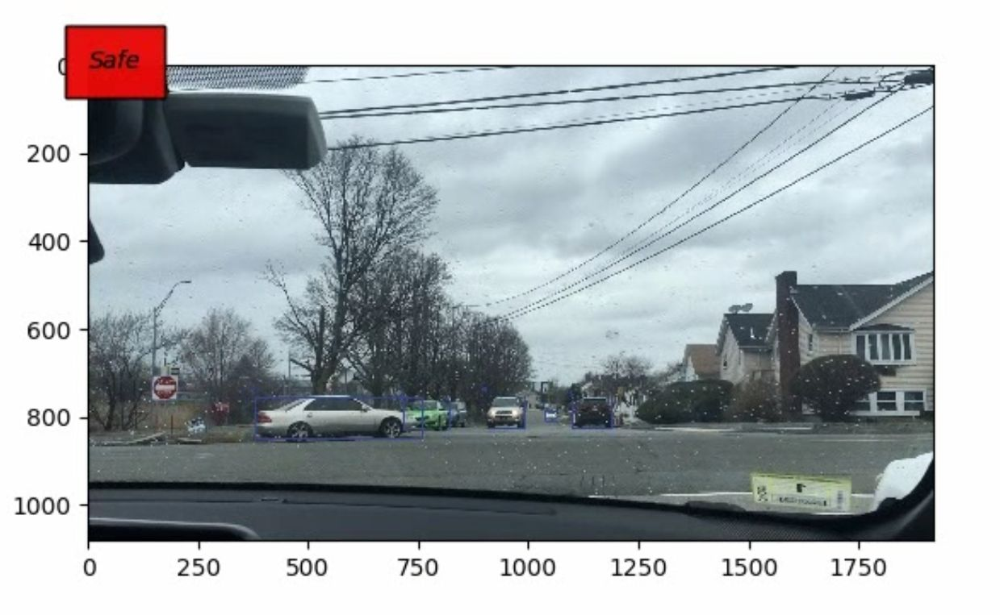

# Intersection Decision Making
Intersection detection is a method to determine whether or not it is safe for a car to move, based on potential obstacles in its environment. The software implements Darknet, an open source convolutional neurak network, and yolo, an object detection framework, to detect crossing cars/pedestrians and determine when it is safe to proceed. The data was gathered using the various cameras on NU's self driving car.
 
### Software Required
* Python3
* Yolo
* Darknet

### Installing

#### Python3
```
$ sudo add-apt-repository ppa:deadsnakes/ppa
$ sudo apt-get update
$ sudo apt-get install python3.6
```
#### Darknet
```
git clone https://github.com/pjreddie/darknet.git
cd darknet
make
mkdir -p obj
./darknet
```
#### Yolo
```
wget https://pjreddie.com/media/files/yolov3.weights
```
To run the detector:

```
./darknet detect cfg/yolov3.cfg yolov3.weights data/dog.jpg
```

### Results

#### Images

    <br/> <br/>   


#### Videos
4-way Intersection: 
<br />
https://www.dropbox.com/s/enfxz1v31fb323w/intersection.avi?dl=0

Making Left Turn:
<br />
https://www.dropbox.com/s/dddh63svqcbi4hj/left_turn.MOV?dl=0

Driving Down Straight Road:
<br />
https://www.dropbox.com/s/rlh6glk9mb2nhkw/straight.avi?dl=0
